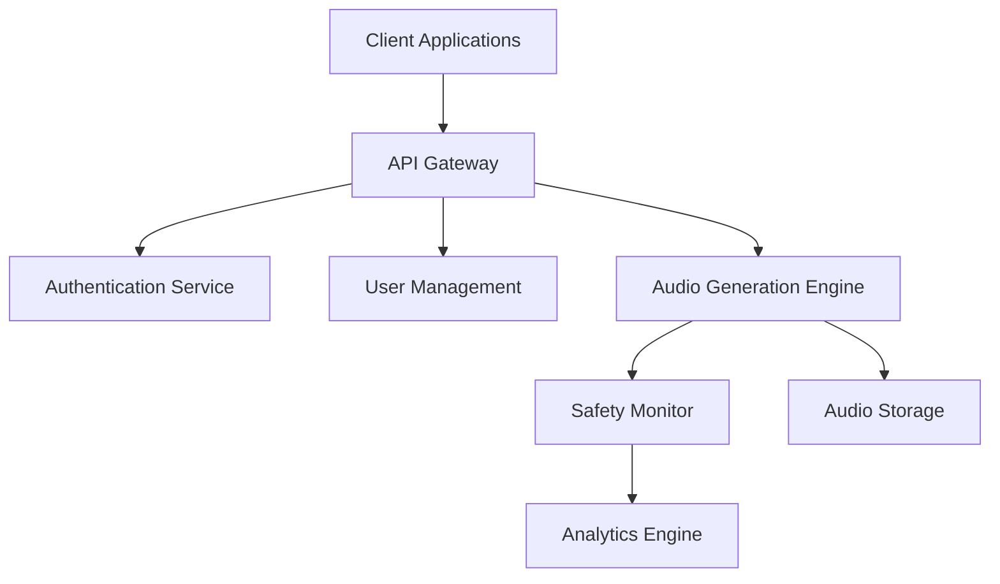
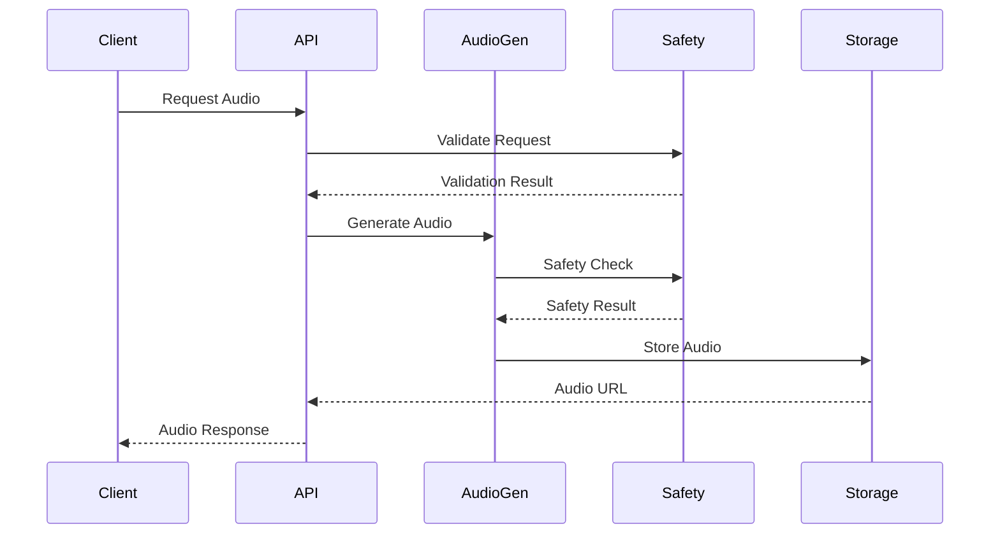

# System Architecture Document

## 1. System Overview

### 1.1 Architecture Principles
- Safety-First Design: All components prioritize user safety
- Real-Time Processing: Minimize latency in audio generation and delivery
- Scalable Architecture: Support growing user base and features
- Resilient Design: Handle failures gracefully
- Secure By Design: Protect sensitive user data

### 1.2 High-Level Architecture


## 2. Component Architecture

### 2.1 Core Services

#### Audio Generation Engine
```python
class AudioGenerationService:
    def __init__(self):
        self.components = {
            'frequency_generator': FrequencyGenerator(),
            'safety_validator': SafetyValidator(),
            'audio_processor': AudioProcessor(),
            'output_formatter': OutputFormatter()
        }
        
    async def generate_audio(self, request: AudioRequest) -> AudioResponse:
        """
        Main audio generation pipeline.
        """
        try:
            # Validate request
            validated_params = await self.validate_request(request)
            
            # Generate base frequencies
            raw_audio = await self.components['frequency_generator'].generate(
                validated_params
            )
            
            # Process audio
            processed_audio = await self.components['audio_processor'].process(
                raw_audio
            )
            
            # Safety check
            safety_result = await self.components['safety_validator'].validate(
                processed_audio
            )
            
            if not safety_result.is_safe:
                raise SafetyValidationError(safety_result.issues)
                
            # Format output
            return await self.components['output_formatter'].format(
                processed_audio
            )
            
        except Exception as e:
            await self.handle_generation_error(e)
```

#### Safety Monitoring Service
```python
class SafetyMonitoringService:
    def __init__(self):
        self.monitors = {
            'real_time': RealTimeMonitor(),
            'session': SessionMonitor(),
            'user': UserMonitor()
        }
        
    async def monitor_session(self, session_id: str) -> SafetyStatus:
        """
        Monitor active session safety.
        """
        status = await self.monitors['real_time'].check(session_id)
        if not status.is_safe:
            await self.handle_safety_violation(status)
        return status
```

### 2.2 Supporting Services

#### User Management Service
```python
class UserManagementService:
    def __init__(self):
        self.user_store = UserStore()
        self.profile_manager = ProfileManager()
        self.session_tracker = SessionTracker()
        
    async def get_user_profile(self, user_id: str) -> UserProfile:
        """
        Retrieve user profile with safety preferences.
        """
        profile = await self.user_store.get_profile(user_id)
        safety_settings = await self.profile_manager.get_safety_settings(user_id)
        return UserProfile(profile, safety_settings)
```

#### Analytics Service
```python
class AnalyticsService:
    def __init__(self):
        self.metrics_collector = MetricsCollector()
        self.analysis_engine = AnalysisEngine()
        
    async def analyze_session(self, session_data: SessionData) -> Analysis:
        """
        Analyze session effectiveness and safety.
        """
        metrics = await self.metrics_collector.collect(session_data)
        return await self.analysis_engine.analyze(metrics)
```

## 3. Data Flow Architecture

### 3.1 Audio Generation Pipeline


### 3.2 Real-Time Monitoring Flow
```python
class RealTimeMonitor:
    def __init__(self):
        self.active_sessions = {}
        self.safety_thresholds = SafetyThresholds()
        
    async def monitor_metrics(self, session_id: str, metrics: SessionMetrics):
        """
        Monitor real-time session metrics.
        """
        if self.detect_anomaly(metrics):
            await self.trigger_safety_protocol(session_id)
```

## 4. Security Architecture

### 4.1 Authentication Flow
```python
class AuthenticationService:
    def __init__(self):
        self.token_manager = TokenManager()
        self.user_validator = UserValidator()
        
    async def authenticate(self, credentials: Credentials) -> AuthToken:
        """
        Authenticate user and generate session token.
        """
        user = await self.user_validator.validate(credentials)
        return await self.token_manager.generate_token(user)
```

### 4.2 Data Protection
```python
class DataProtectionService:
    def __init__(self):
        self.encryption = EncryptionManager()
        self.access_control = AccessControl()
        
    async def protect_user_data(self, data: UserData) -> ProtectedData:
        """
        Encrypt and protect user data.
        """
        encrypted_data = await self.encryption.encrypt(data)
        return await self.access_control.apply_policies(encrypted_data)
```

## 5. Scalability Architecture

### 5.1 Load Balancing
```python
class LoadBalancer:
    def __init__(self):
        self.service_registry = ServiceRegistry()
        self.health_checker = HealthChecker()
        
    async def route_request(self, request: Request) -> Response:
        """
        Route request to appropriate service instance.
        """
        available_services = await self.health_checker.get_healthy_services()
        selected_service = await self.select_optimal_service(available_services)
        return await self.forward_request(request, selected_service)
```

### 5.2 Caching Strategy
```python
class CacheManager:
    def __init__(self):
        self.audio_cache = AudioCache()
        self.user_cache = UserCache()
        
    async def cache_audio(self, audio_id: str, audio_data: AudioData):
        """
        Cache generated audio for quick retrieval.
        """
        cache_key = self.generate_cache_key(audio_id)
        await self.audio_cache.set(cache_key, audio_data)
```

## 6. Error Handling

### 6.1 Error Recovery
```python
class ErrorRecoveryService:
    def __init__(self):
        self.error_handler = ErrorHandler()
        self.recovery_strategies = RecoveryStrategies()
        
    async def handle_error(self, error: SystemError) -> RecoveryResult:
        """
        Handle system errors and attempt recovery.
        """
        strategy = await self.select_recovery_strategy(error)
        return await strategy.execute()
```

### 6.2 Failover Systems
```python
class FailoverSystem:
    def __init__(self):
        self.health_monitor = HealthMonitor()
        self.backup_systems = BackupSystems()
        
    async def handle_failure(self, service_id: str):
        """
        Handle service failure and activate backup.
        """
        backup_service = await self.backup_systems.activate(service_id)
        await self.health_monitor.verify_backup(backup_service)
```

## 7. Deployment Architecture

### 7.1 Container Organization
```yaml
# docker-compose.yml
version: '3.8'
services:
  api_gateway:
    image: resonera/api_gateway
    ports:
      - "8000:8000"
    
  audio_generator:
    image: resonera/audio_generator
    volumes:
      - audio_data:/data
      
  safety_monitor:
    image: resonera/safety_monitor
    depends_on:
      - audio_generator
      
  analytics:
    image: resonera/analytics
    volumes:
      - analytics_data:/data
```

### 7.2 Scaling Configuration
```python
class ScalingManager:
    def __init__(self):
        self.metrics_collector = MetricsCollector()
        self.scaling_rules = ScalingRules()
        
    async def adjust_capacity(self, metrics: SystemMetrics):
        """
        Adjust system capacity based on load.
        """
        if await self.needs_scaling(metrics):
            await self.scale_services(metrics)
```

## 8. Monitoring Architecture

### 8.1 System Monitoring
```python
class SystemMonitor:
    def __init__(self):
        self.metrics_collector = MetricsCollector()
        self.alert_manager = AlertManager()
        
    async def monitor_system_health(self):
        """
        Monitor overall system health.
        """
        metrics = await self.metrics_collector.collect_system_metrics()
        if await self.detect_issues(metrics):
            await self.alert_manager.trigger_alert(metrics)
```

### 8.2 Performance Monitoring
```python
class PerformanceMonitor:
    def __init__(self):
        self.performance_metrics = PerformanceMetrics()
        self.threshold_manager = ThresholdManager()
        
    async def monitor_performance(self):
        """
        Monitor system performance metrics.
        """
        metrics = await self.performance_metrics.collect()
        if await self.threshold_manager.check_thresholds(metrics):
            await self.handle_performance_issue(metrics)
```